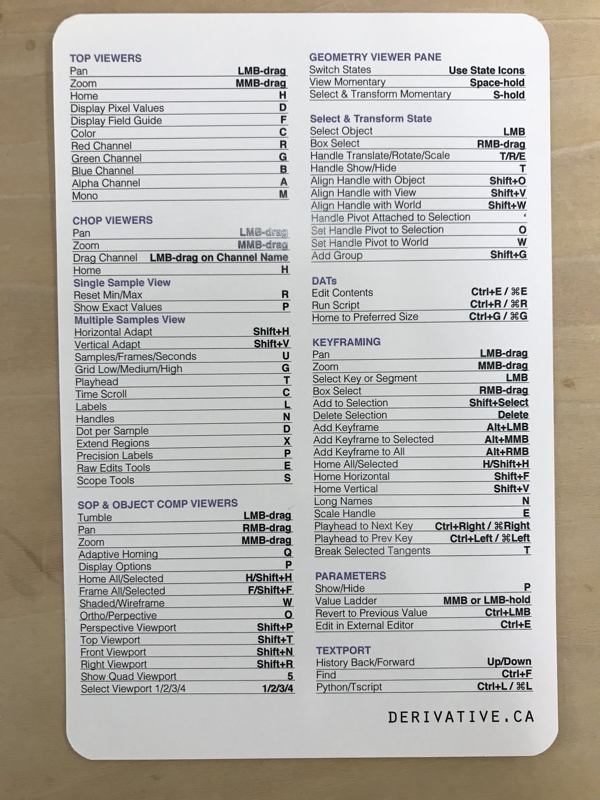

# EyeHacker引継ぎ（2020/03/17）

## ネットワーク

* カメラ入力
  * `Insta360Air`オペレータ側がInsta360Airを使うときのオペレータ群，`THETA`オペレータ側がTHETAを使うときのオペレータ群になっている．繋いだカメラに応じて適宜バイパス・`switch1`オペレータの`Index`変更をする．
    * Insta360Airオペレータ側では，`toEquirectangular`オペレータによる画像形式変換が入る．
  * `transform2`オペレータで，提示映像の正面を合わせておくと後が楽．
* 録画・再生
  * `replicator1`オペレータで`item[1-5]`オペレータが複製されている．
  * `item[1-5]`オペレータ内，`videoMaster`オペレータは録画を，`playerMaster`は動画再生を担う．
    * `videoMaster`オペレータは`moviefileout1`オペレータによって録画するとともに，録画中であることを示すフラグを`playerMaster`オペレータに送る．
    * `playerMaster`オペレータは`moviefilein1`オペレータによって動画を再生する．
      * `videoPlayer`オペレータから送られてきたフラグを元に，録画終了の一定時間後に自動reload処理を入れる．
      * `switch1`オペレータの`Index`を0ではなく1にすると，dual-fisheye形式動画をequirectangular形式動画に変換する処理が挟まる．dual-fisheye形式動画を録画データとして持っているときに操作する．
  * `item0`オペレータは，`itemMaster`オペレータから録画・動画の再生機能を抜いて，リアルタイム映像を流したもの．
* レイヤー映像
  * `replicator2`オペレータで`area[1-2]`オペレータが複製されている．
  * `area[1-2]`オペレータ内，`setButtons`オペレータによって`area[1-2]Switch`オペレータの`Index`を，`playButton`オペレータによって`item[1-5]`オペレータのカスタムパラメータを操作している．
* 音周り
  * `audioManager`オペレータ内，`saveNoiseFile`オペレータと`saveNoise`オペレータの組み合わせで，録音すべき波形を貯めてファイルに書き出している．このファイルは`reloadButton`オペレータによって読み込まれる．
  * `audioBlender`オペレータは`AudioMovie`CHOPを`Math`CHOPを用いてミックスすることで，アルファブレンドの比率に応じた音再生を実現している．
  * `Audio Dynamics`オペレータを挟むことで，音がサチってぷつっとした音が鳴るのを防止する．
* 視線位置取得
  * `sensor`オペレータ側はHMDの向きを，`oscin1`オペレータ側は`GazeDirectionSender`プロジェクト（Unity）から送られてくる視線のHMDの向きに対する相対値を持つ．これらを`math1`オペレータで足しこむ．
  * `RTP`オペレータは極座標系でのr/theta/phi，`UV`オペレータはUV座標系での位置を持つ．
* マスク画像
  * `setMask`オペレータによってマスク画像を生成する．カスタムパラメータとして視線位置を渡してある．
  * `setMask`オペレータ内で，`maskShape`オペレータの値を参照してマスク画像の形を操作している．
* 映像混合・再生
  * `blendTextures`オペレータにマスク画像とレイヤー映像を渡すことで，映像が混合される．アルファブレンドの比率は`ratioSlider`オペレータで指定する．
  * 映像をHMDに提示している実体が`viveSimple`オペレータ．内部を改造して視点を原点に固定している．詳しくは[Qiita記事](https://qiita.com/radi_bow/items/02c722592b987ddc1752)に．
* risk計算
  * `getRiskTexture`オペレータでrisk計算に使う画像を計算する．
  * `calculateRisk`オペレータで，範囲内のピクセル輝度値の総和を取る形でrisk計算をしている．カスタムパラメータとして，視線のUV座標・`innerRiskDiameter`オペレータの値・`outerRiskDiameter`オペレータの値を渡してある．
  * `outerRingRisk`の値はEyeHackerシステムでは利用していないが，実験で「視点周辺のriskは低いが，少し離れた領域のriskは高い状況」を担保したいときに使えるかも．
* 頭部速度取得
  * `calculateHMDVelocity`オペレータ内でHMDの回転角速度をdeg/s単位で計算している．
    * 余弦定理より，（前フレームとの空間座標系での視点位置差の絶対値）^2 = 1^2 + 1^2 - 2 cos（前フレームとの角度差）である．これを用いて`math3`オペレータ・`function7`オペレータで求めた前フレームとの角度差にfps値を掛ける．
    * 実際は`trail1`オペレータと`analyze1`オペレータを組み合わせて計算した直近5フレームの平均値を，角速度として出力している．
* risk/threshold比較
  * `calculateHMDFactor`オペレータは，頭部回転が速くなるにつれ増加していくriskの減少値を計算する．これを用いてriskを補正するには`reflectHMDFactor`オペレータのバイパスを止める．
  * `judgement`オペレータは，`judgementBinary`オペレータによって指定された条件が満たされているとき1を，満たされていないとき0を持つ．この値を`comparison`オペレータに渡す．
  * `timer`オペレータ内部は，`comparison`オペレータの値が1のとき`tPlus`が増加し，0のとき`tMinus`が増加するというように振る舞う．`tPlus`から`tMinus`を引くことで，時間の巻き戻しを実現する．
  * 指定された時間が経ったことは，`trigger`オペレータの値が0から1に，あるいは1から0に遷移することで表現される．
    * このとき`chopexec5`オペレータによって`colorBinary`オペレータがclickされる．
* 自動混合
  * `calculateBlendTime`オペレータによって，頭部回転角速度を反映した，映像混合にかける時間を指定・計算する．
  * `calculateRatioPerFrame`オペレータによって，1フレームでどのくらいアルファブレンドの比率を増減させれば良いかを計算する．
    * これにより`ratioPerFrame`オペレータに入った値の符号は，増減方向とは一致しないことに注意する．`changeRatio`オペレータのコード内で符号の辻褄を合わせている．
  * `overBorderOrNot`オペレータの値を`calculateRatioPerFrame`オペレータで参照することによって，「ある程度までは危険になったときシーン遷移前に巻き戻すが，閾値を超えたら危険になったとき急いでシーン遷移を完了させる挙動」を実現する．
  * `chopexec6`オペレータによって，`autoRatio`オペレータの値が`ratioSlider`オペレータに反映される．
    * ちなみにオペレータにつけた色は，同じ色のオペレータが繋がっていなくとも密接に関係していることを示している．
* ユーティリティ
  * 基本的に各処理は`CHOP Execute`DAT内に書かれている．
  * `saveLog`オペレータ内，`data`オペレータの数値データが`log`オペレータ内にDATの形で貯まっていく．他にもログを取りたいものがあれば，`data`オペレータの内容と`logging`オペレータ・`saveDataFile`オペレータのコードを適宜変更する．

## 積み残したこと

* マスク画像の自動生成
  * `blendTextures`オペレータに入力する`maskTexture`を変えることで出来そう
* risk計算の改善
  * `calculateRisk`オペレータの内部を変えることで出来そう
* 音周りの改善
  * 音周りに関連したオペレータ群をいじることになりそう
  * ちなみにTouchDesigner 2020には`Audio File Out CHOP`が[追加された](https://derivative.ca/community-post/2020-official-update)ので，これも使えると良いかも
* 映像を切り替えた瞬間からフレーム指定して再生開始
  * 録画・再生に関連したオペレータ群をいじることになりそう
* 実験の組み立て
  * `OldProjects/ExperimentController/itoMasterThesis`内のプロジェクトが，ログの取り方等の参考になる

## 参考文献

* [Visual Thinking with TouchDesigner
プロが選ぶリアルタイムレンダリング＆プロトタイピングの極意](http://www.bnn.co.jp/books/8842/)
  * これをなんとなくでも良いから理解しないと何も始まらない．最初から最後まで読むべき．
  * 特に2章全て・3-2節・3-3節・3-7節・3-9節・3-11節・3-14節・3-15節・AppendixのPython周りの節の話を多用している．
* [TouchDesignerのオペレータをPythonで繋ぐ](https://qiita.com/radi_bow/items/24f7384d9bfaafdd5d3c)
  * 映像の録画・再生やレイヤー映像指定のところでこのテクニックを使っている．
* [[TouchDesigner] UnityのMonoBehaviour的なノードを見つけたという話](https://qiita.com/kodai100/items/9b1b4be6f07c2fad1657)
  * risk計算でこのテクニックを使っている．
* [TouchDesigner 複数カメラをボタンでスイッチング](https://qiita.com/atsonic/items/8aeb32c4933b9f05673b)
  * 内容自体はあまり関係ないが，ラジオボタン周りやReplicator COMPの知見が得られる．
* [TouchDesigner 処理が重くなっている個所を見つける方法](https://qiita.com/narumin256/items/cf18280156ed12101943)
  * Palette内のTools->probeを使って調べようねというお話．
* [TouchDesignerでのVR開発で頭部に追従するカーソルを実装する](https://qiita.com/radi_bow/items/02c722592b987ddc1752)
  * 頭部方向・視線位置を適切に取得するところでこのテクニックを使っている．
* ショートカットキーリスト

